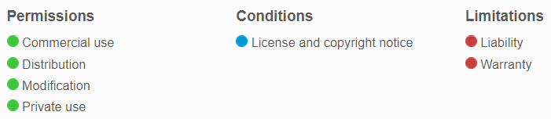

# Loan Qualifier App

This is a python command-line interface (CLI) that allows the user(loan seeker) to see qualifying loans from lenders. The application works by taking a loan criteria from various loan providers in the form of a CSV sheet located by the user through CLI, asking the user a number of questions to evaluate thier loan eligibility , and then returning to them a list of qualifying loans with the ability to save results to a new CSV file in the user specified location.


---


## Technologies

This project leverages python 3.7 with the following packages:

* [fire](https://github.com/google/python-fire) - For the command line interface, help page, and entry-point.

* [questionary](https://github.com/tmbo/questionary) - For interactive user prompts and dialogs


---

## Installation Guide

You will need Python version 3.7 or above and gitbash/terminal on your computer, along with other supporting packages as mentioned below. 

Please follow instructions from the below link to install python 3.7 or above on your computer

[To install Python, follow instructions from this link](https://www.python.org/downloads/)

[To install Git Bash, follow instructions from this link](https://github.com/git-guides/install-git)

Before running the application first install the following dependencies.

```python
  pip install fire
  pip install questionary
```


---


## Usage

To use the Loan Qualifier Application, clone the repository and run the **app.py**

```git
git clone https://github.com/sidbetatester/loan_qualifier_app.git
```

```python
python app.py
```

Upon launching the loan qualifier application you will be greeted with the following prompts. The values in yellow are examples of user input to the questions.


Note:
* Remember to provide .csv when you specify the file names for source data and saving results.
* You will be prompted to save the results only if you have qualifying loan suggestions.


---


## Contributors

Siddharth Venkumahanti
[linkedin](https://www.linkedin.com/in/siddharthvenkumahanti/)


---


## License

### MIT License

Copyright (c) [2022] [Siddharth Venkumahanti]

Permission is hereby granted, free of charge, to any person obtaining a copy
of this software and associated documentation files (the "Software"), to deal
in the Software without restriction, including without limitation the rights
to use, copy, modify, merge, publish, distribute, sublicense, and/or sell
copies of the Software, and to permit persons to whom the Software is
furnished to do so, subject to the following conditions:

The above copyright notice and this permission notice shall be included in all
copies or substantial portions of the Software.

THE SOFTWARE IS PROVIDED "AS IS", WITHOUT WARRANTY OF ANY KIND, EXPRESS OR
IMPLIED, INCLUDING BUT NOT LIMITED TO THE WARRANTIES OF MERCHANTABILITY,
FITNESS FOR A PARTICULAR PURPOSE AND NONINFRINGEMENT. IN NO EVENT SHALL THE
AUTHORS OR COPYRIGHT HOLDERS BE LIABLE FOR ANY CLAIM, DAMAGES OR OTHER
LIABILITY, WHETHER IN AN ACTION OF CONTRACT, TORT OR OTHERWISE, ARISING FROM,
OUT OF OR IN CONNECTION WITH THE SOFTWARE OR THE USE OR OTHER DEALINGS IN THE
SOFTWARE.




